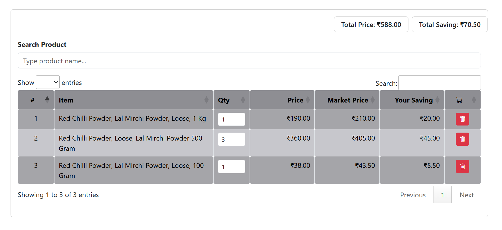

# 🛒 Product Table Manager

An interactive product table that lets user search items from an external API, add them to a table, change quantities, calculate totals, and undo deletions — all in a smooth, responsive UI.

## Features

- Live product search with dropdown suggestions
- Add products with real-time price & saving calculation
- Editable quantity inputs
- Row deletion with undo option
- Total price and savings summary

## Screenshot



## Tech Stack

- HTML, CSS, JavaScript
- jQuery
- DataTables
- Bootstrap

## Getting Started

1. Clone the repo:
   ```bash
   git clone https://github.com/kloudklub/nmjs.git
   cd nmjs
