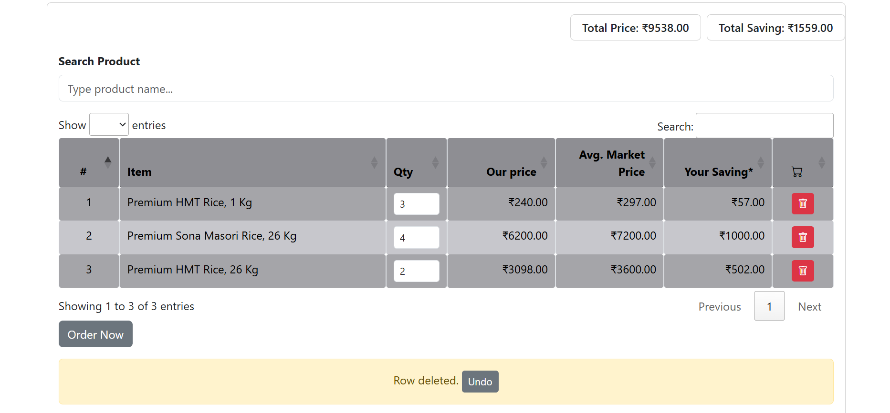
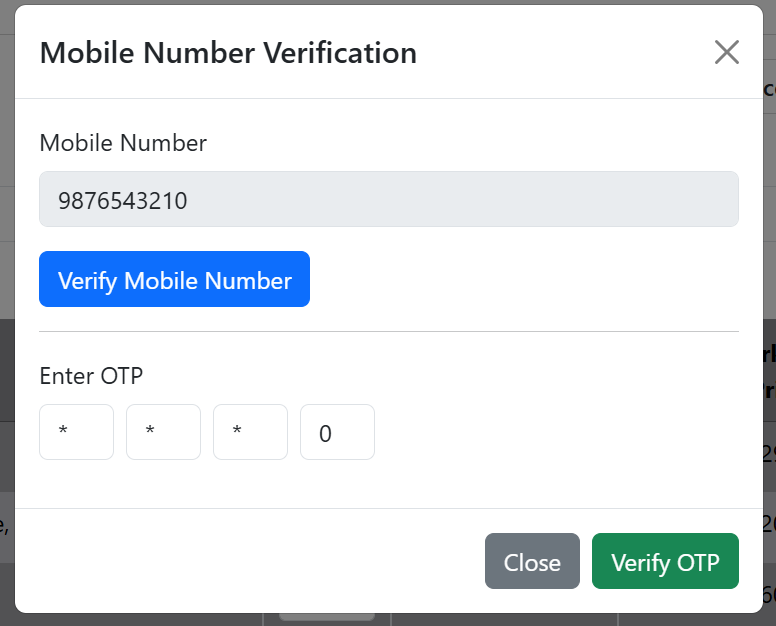

# 🛒 Product Cart with OTP Verification UI

An interactive product table that lets user search items from an external API, add them to a table, change quantities, calculate totals, and undo deletions — all in a smooth, responsive UI.

## Features

- 🔍 Live **product search** using API
- 🛒 Dynamic **cart management**
  - Add/remove items
  - Change quantity
  - Calculate price, MRP, and savings
- 🗑️ **Undo delete** functionality
- 📱 **Mobile OTP verification** modal
- ✅ OTP verification
- 🔄 All logic is modular and organized

## Screenshots

#### Product Cart UI



#### Modal UI



## Tech Stack

- HTML, CSS, JavaScript
- jQuery
- DataTables
- Bootstrap

## 📂 File Structure

```
├── .vscode
├── assets/
│   ├── images/
│   └── javascript/
│       ├── otpModel.js
|       └── productTable.js
│
├── d/                          # DIR
│   └── index.html              # Desktop-specific layout
├── m/                          # DIR
│   └── index.html              # Mobile-specific layout
│
├── index.html                  # Entry point: device detection + redirect
├── README.md

```

## Getting Started

1. Clone the repo:
   ```bash
   git clone https://github.com/kloudklub/nmjs.git
   cd nmjs
   ```

## 🙋‍♂️🧑‍💻 Current Maintainer Team

**Forrce Infotech Solutions India Pvt Ltd.**  
📧 Email: [info@forrce.com](mailto:info@forrce.com)  
🌐 Website: [https://forrce.com/in/](https://forrce.com/in/)
